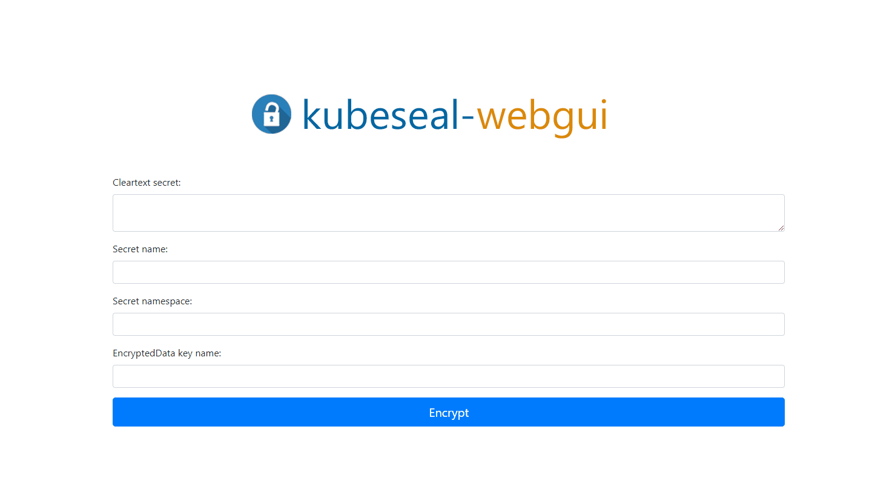

# Web-Gui for Bitnami Sealed-Secrets

   

  

## Description

This is a python based webapp for using Bitnami-Sealed-Secrets in a web-gui.

This app uses the kubeseal binary of the original project: <https://github.com/bitnami-labs/sealed-secrets>

The docker image can be found here: https://hub.docker.com/repository/docker/kubesealwebgui/kubeseal-webgui

## Demo

## Prerequisites

To use this Web-Gui you have to install [Bitnami-Sealed-Secrets](https://github.com/bitnami-labs/sealed-secrets) in your cluster first!

## Usage

Mount the public certificate of your sealed secrets controller to `/kubeseal-webgui/cert/kubeseal-cert.pem` in the Docker container.

Please use the [helm chart](https://github.com/Jaydee94/kubeseal-webgui/tree/master/chart/kubeseal-webgui) which is included in this repository.

### Get Public-Cert from sealed-secrets controller

(Login to your kubernetes cluster first)

`kubeseal --fetch-cert --controller-name <your-sealed-secrets-controller> --controller-namespace <your-sealed-secrets-controller-namespace> > kubeseal-cert.pem`

# Contribute

Make sure you have `Python 3.8` and the Python module `venv` installed.

Setup:

* Clone this repository and `cd` into it.
* `python3 -m venv venv` (to create a virtual environment called `venv` that doesn't interfere with other projects)
* `source venv/bin/activate` (to activate the virtual environment)
* `python -m pip install -r requirements.txt` (to install all required packages for this project)
* `pytest` (should run all tests successfully)
* Pick an issue and start coding.
